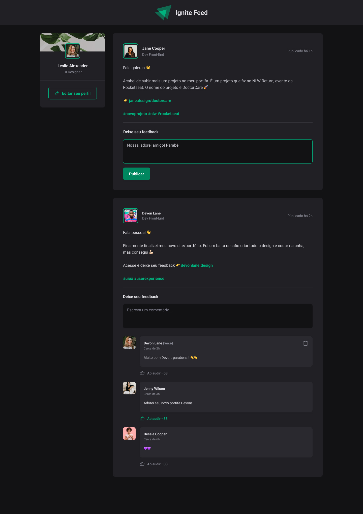

<h1 align="center"> Fundamentos React Typescript </h1>

ignite-reactjs-01-fundamentos-react  

  

 

  

## 🚀 Tecnologias

Esse projeto foi desenvolvido com as seguintes tecnologias:

- Git e Github
- Figma
- Nodejs
- React
- Typescript

## 💻 Projeto

Projeto que imita basicamente uma rede social, onde teremos varios posts, podendo fazer comentarios e dar varios likes, super simples mas com objetivo de aprender os fundamentos para poder começar a utilizar o Reactjs com typescript.
